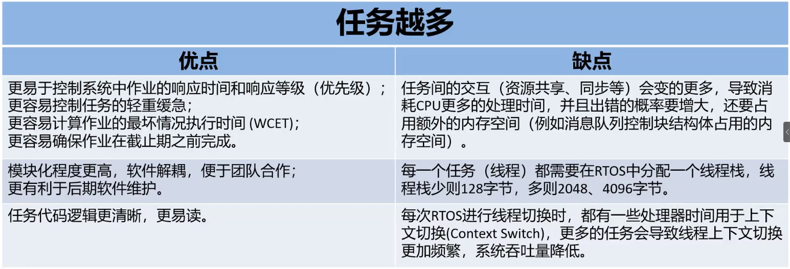
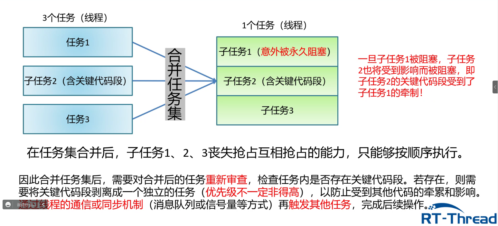
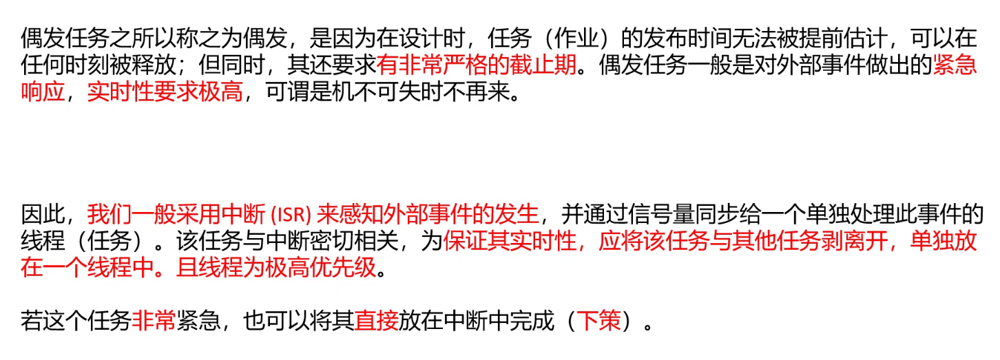
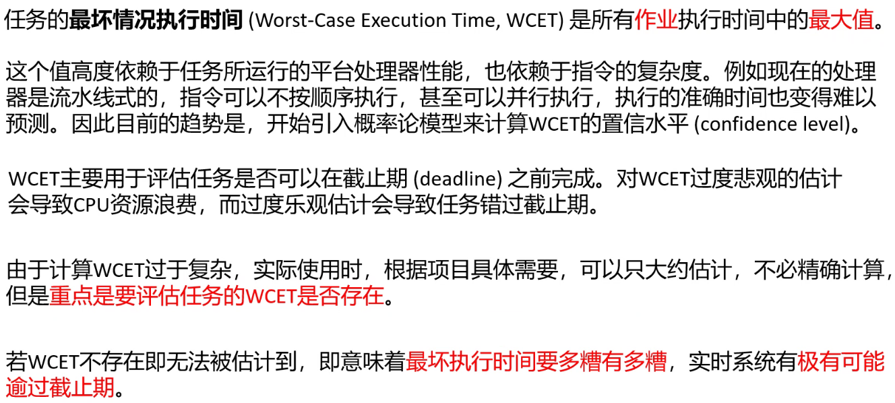
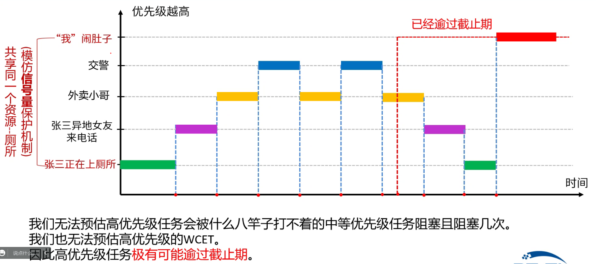
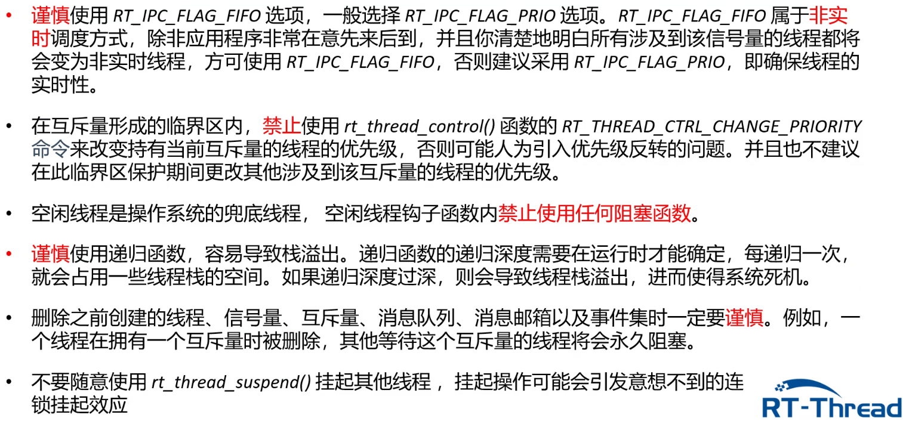

# 8 Days

- #### 多任务设计

  

  - ##### 任务合并

    根据实际情况，可以考虑以将下几种任务集合合并为一个任务的可能：

    1.功能关系或逻辑关系密切的任务集

    2.触发条件相同的任务集

    3.运行周期相同的任务集

    4.顺序执行并且互相无并发要求的任务集

    **任务合并后要剥离关键代码段**

    

    

  - ##### 最坏情况执行时间

    

    优先级的安排原则：

    和中断有关的任务应该安排尽可能高的优先级，以便处理异步事件。一般用中断来触发的任务，属于偶发任务，实时性要求高。

    WCET较长或相对截至期较短的任务，应该设置较高的优先级

    对于周期任务，周期越短，优先级越高，以防止作业堆积

    满足优先约束的任务集，应按照信息流动方向，上游任务优先级高于下游任务优先级

    优先级的安排应该留有余地(例如:1、4、7、10......)

  - ##### 临界段

    临界段用一句话概括就是一段在执行的时候不能被中断的代码段。

    ```assembly
    ;/*关中断*/
    ;/*
    ;*rt_base_t rt_hw_interrupt_disable();
    ;*/
    rt_hw_interrupt_disable PROC
    	EXPORT rt_hw_interrupt_disable
    	MRS r0, PRIMASK
    	CPSID I
    	BX LR
    	ENDP
    ```

    通过 MRS 指令将特殊寄存器 PRIMASK 寄存器的值存储到通用寄存器 r0。当在 C 中调用汇编的子程序返回时，会将 r0 作为函数的返回值。所以在 C 中调用 rt_hw_interrupt_disable() 的时候 ， 需 要 事 先 声 明 一 个 变 量 用 来 存 储rt_hw_interrupt_disable()的返回值，即 r0 寄存器的值，也就是 PRIMASK 的值。

    ```assembly
    ;/*开中断*/
    ;/*
    ; * void rt_hw_interrupt_enable(rt_base_t level);
    ; */
    rt_hw_interrupt_enable PROC (1)
    	EXPORT rt_hw_interrupt_enable (2)
    	MSR PRIMASK, r0
    	BX LR (3)
    	ENDP 
    ```

    通过 MSR 指令将通用寄存器 r0 的值存储到特殊寄存器 PRIMASK。当在 C 中调用汇编的子程序返回时，会将第一个形参传入到通用寄存器 r0。所以在 C 中调用 rt_hw_interrupt_enable()的时候，需要传入一个形参，该形参是进入临界段之前保存的PRIMASK 的值。

  - ##### 优先级反转

    优先级反转分为有界优先级反转和无界优先级反转，在RT-Thread系统中可以存在有界优先级反转，但绝不允许无界优先级反转的发生，因为其会使WCET无法预期无法期盼，变得非常糟糕，进而导致系统不实时。

    使用互斥量，并不是防止优先级反转的发生，而是将无界优先级反转转变为有界优先级反转。

    

    互斥锁将无界优先级转变为有界优先级的基本原理

    

  - ##### 多线程设计的注意事项

    